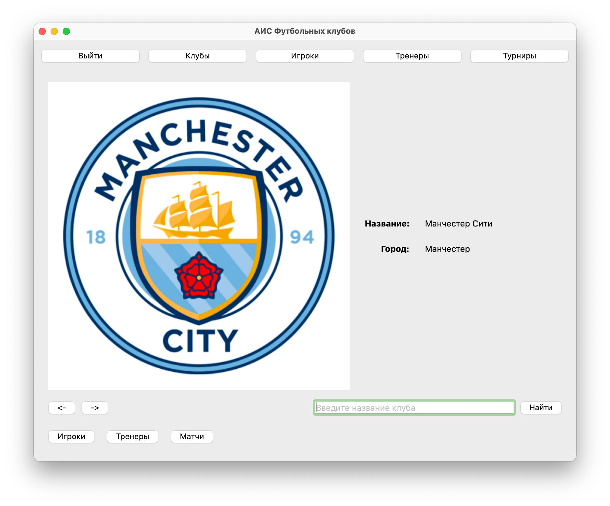
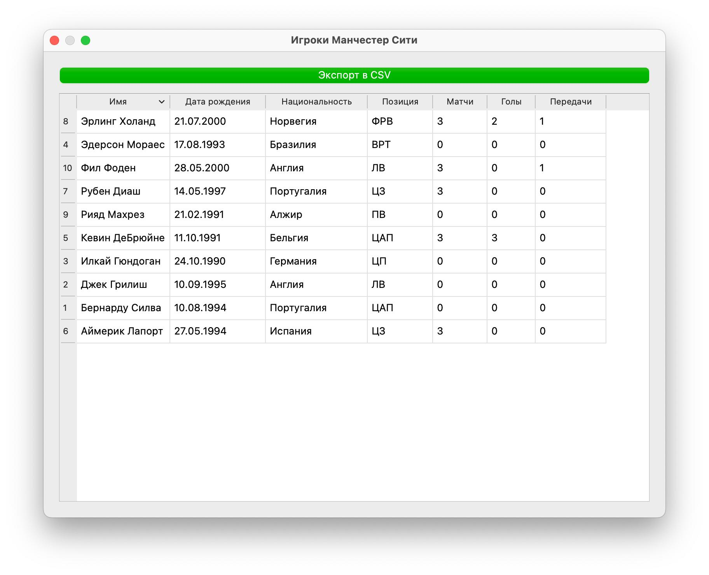
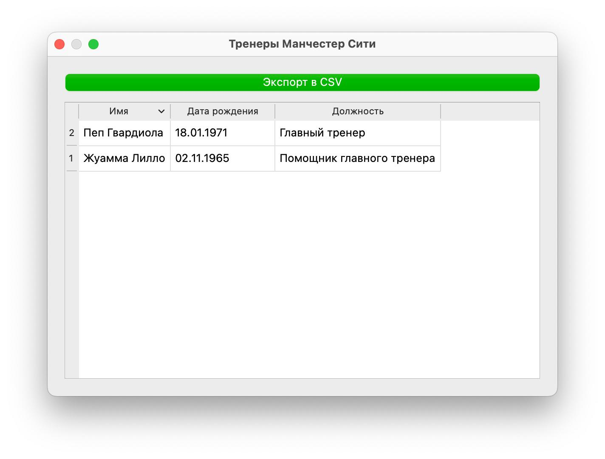
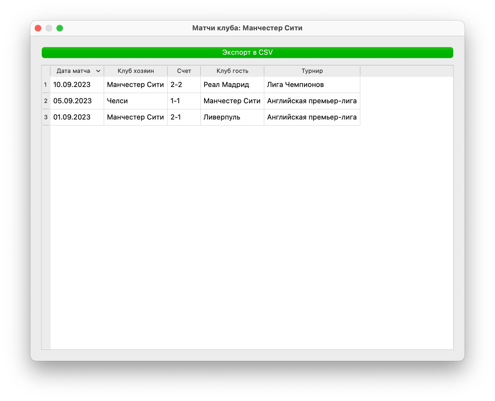
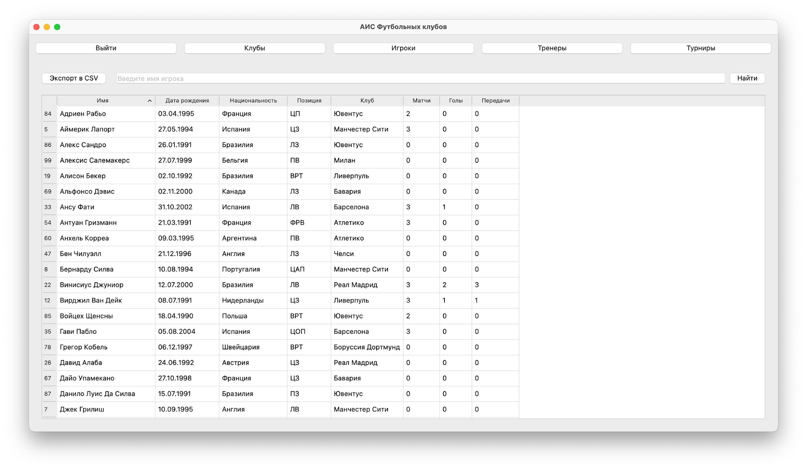
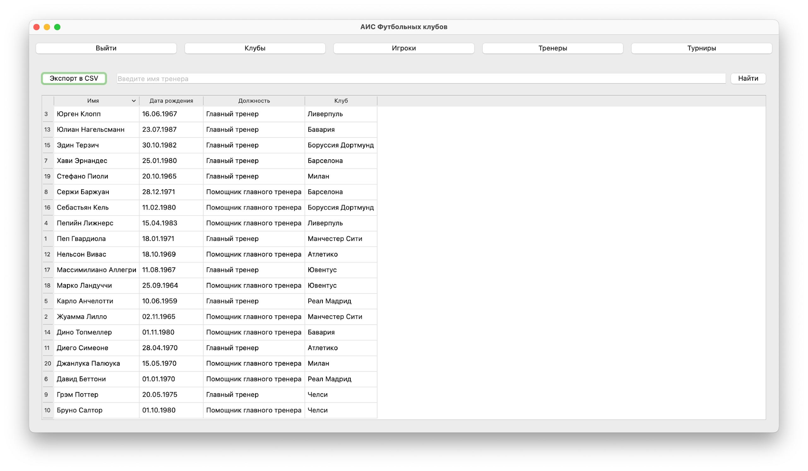
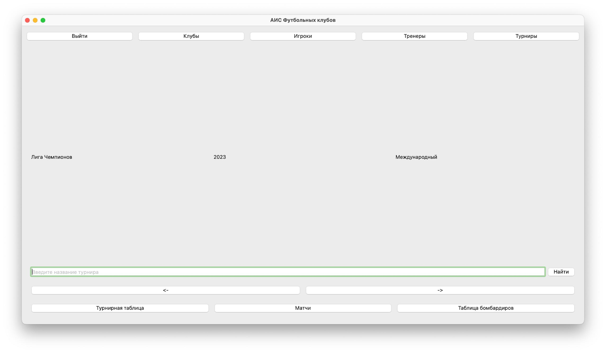
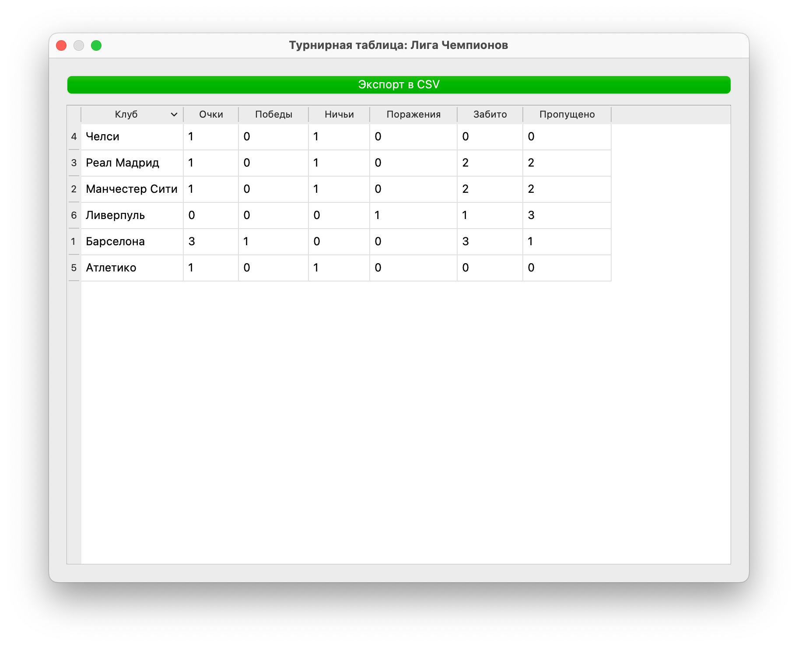
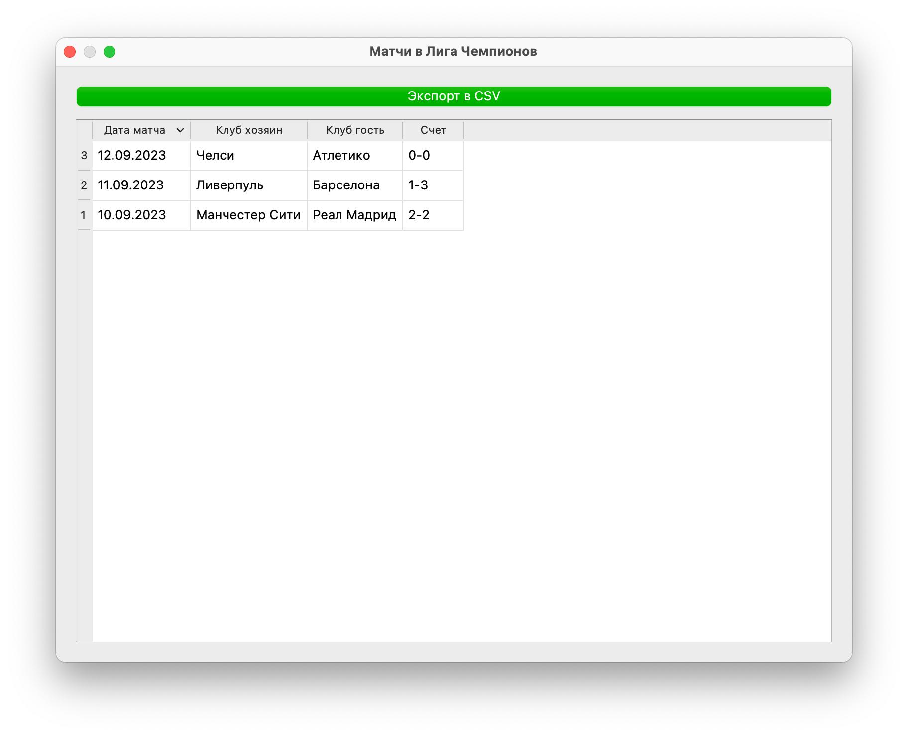
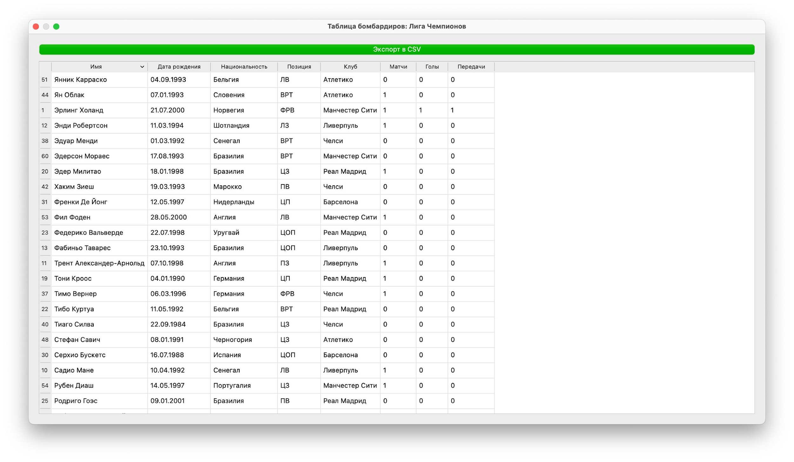

# Football Clubs

Учебное настольное приложение для работы с данными футбольных клубов, игроков, тренеров, матчей и турниров. Программа предоставляет пользовательский и административный интерфейсы, подключается к PostgreSQL и отображает данные через Qt-таблицы и отдельные страницы.

## Возможности

### Пользовательский интерфейс

- вход в приложение с разделением пользовательской и административной роли;
- просмотр футбольных клубов с логотипом, названием и городом;
- поиск клубов и турниров;
- просмотр игроков, тренеров, матчей и турниров;
- сортировка табличных данных;
- просмотр статистики игроков: матчи, голы и передачи;
- просмотр турнирной таблицы и списка бомбардиров;
- экспорт таблиц в CSV;
- переход между разделами без закрытия главного окна.

### Административный интерфейс

Для администратора предусмотрены отдельные страницы управления клубами, игроками, тренерами, турнирами, матчами и статистикой игроков.

## Демонстрация работы



<p align="center"><em>Рисунок 1. Страница клуба</em></p>

На странице отображаются основные сведения о выбранном футбольном клубе: название, город и логотип. Пользователь может переходить между клубами, выполнять поиск по названию, а также открывать связанные таблицы игроков, тренеров и матчей.



<p align="center"><em>Рисунок 2. Игроки клуба</em></p>

В таблице представлены игроки выбранного клуба, их персональные данные и основные показатели выступлений: количество матчей, голов и результативных передач. Данные можно сортировать, а таблицу — экспортировать в CSV-файл.



<p align="center"><em>Рисунок 3. Тренеры клуба</em></p>

На странице отображается список тренеров, связанных с выбранным клубом, включая имя, дату рождения и должность. Таблица поддерживает сортировку и экспорт отображаемых данных в CSV.



<p align="center"><em>Рисунок 4. Матчи клуба</em></p>

В таблице выводится история матчей выбранного клуба с датой проведения, командами-участниками, счётом и названием турнира. Пользователь может сортировать записи и сохранять результаты просмотра в CSV.



<p align="center"><em>Рисунок 5. Страница игроков</em></p>

Страница предназначена для просмотра сводной информации обо всех игроках, содержащихся в базе данных. Реализован поиск по имени или фамилии, сортировка столбцов и экспорт сформированной таблицы в CSV.



<p align="center"><em>Рисунок 6. Страница тренеров</em></p>

Пользователь получает общий список тренеров с указанием даты рождения, должности и клуба. Доступны фильтрация по имени, сортировка результатов и экспорт данных в CSV-файл.



<p align="center"><em>Рисунок 7. Страница турнира</em></p>

На странице отображаются название турнира, год проведения и страна. Предусмотрена навигация между турнирами, поиск по названию, а также переход к турнирной таблице, матчам и таблице бомбардиров.



<p align="center"><em>Рисунок 8. Турнирная таблица</em></p>

Таблица формируется на основе результатов матчей выбранного турнира и содержит количество очков, побед, ничьих, поражений, забитых и пропущенных мячей. Результаты сортируются по спортивным показателям и доступны для экспорта в CSV.



<p align="center"><em>Рисунок 9. Матчи в турнире</em></p>

На странице отображаются матчи выбранного турнира с датами, командами-участниками и итоговыми счетами. Данные представлены в табличном виде, поддерживают сортировку и экспорт.



<p align="center"><em>Рисунок 10. Таблица бомбардиров</em></p>

В таблице представлены игроки, участвовавшие в матчах турнира, их клубы, количество матчей, голов и результативных передач. Список отсортирован по результативности и может быть экспортирован в CSV.

## Стек технологий

- **C++17**;
- **Qt Widgets** — графический интерфейс, окна, формы и таблицы;
- **Qt SQL** — подключение к базе данных и выполнение SQL-запросов;
- **PostgreSQL** — хранение данных о футбольных клубах и связанных сущностях;
- **QSqlQuery, QSqlQueryModel, QSortFilterProxyModel** — получение, отображение и сортировка данных;
- **QMake** — конфигурация сборки через файл `Football_clubs.pro`;
- **Qt Designer** — интерфейсные формы `.ui`;
- **CSV** — экспорт данных из табличных представлений.

## Сборка и запуск

Для запуска необходимы Qt с модулями `Widgets` и `Sql`, PostgreSQL с доступной базой данных, а также драйвер Qt `QPSQL`.

1. Настройте локальную базу данных PostgreSQL `football_clubs` со схемой, которую использует приложение.
2. Проверьте параметры подключения в `files/databasemanager.cpp`.
3. Откройте проект `files/Football_clubs.pro` в Qt Creator.
4. Выберите Desktop Kit с установленным Qt и PostgreSQL-драйвером.
5. Соберите и запустите проект.

Также проект можно собрать из командной строки с помощью `qmake`:

```bash
cd files
qmake Football_clubs.pro
make
./Football_clubs
```

На Windows вместо `make` используется `mingw32-make` или сборка через выбранный генератор Qt Creator.

## Структура проекта

```text
FootballClubs/
├── files/
│   ├── *.cpp, *.h          # Исходный код приложения
│   ├── *.ui                # Формы Qt Designer
│   └── Football_clubs.pro  # Конфигурация QMake
├── logos/                  # Логотипы футбольных клубов
├── docs/demo/             # Скриншоты демонстрации работы
└── README.md               # Документация проекта
```

Основные компоненты приложения:

- `databasemanager.*` — подключение и отключение от PostgreSQL;
- `loginpage.*` — авторизация и выбор пользовательского интерфейса;
- `mainwindow.*` — основное окно пользователя;
- `clubpage.*`, `playerpage.*`, `coachpage.*`, `tournamentpage.*` — страницы просмотра данных;
- `admin*.cpp/h` — административные страницы;
- `utils.*` — вспомогательные операции, включая экспорт таблиц в CSV;
- `main.cpp` — точка входа приложения.

## Статус проекта

Учебное Qt-приложение реализует пользовательский и административный интерфейсы для просмотра и управления футбольными данными. Для полноценного запуска требуется предварительно настроенная база PostgreSQL и установленный драйвер `QPSQL`.
