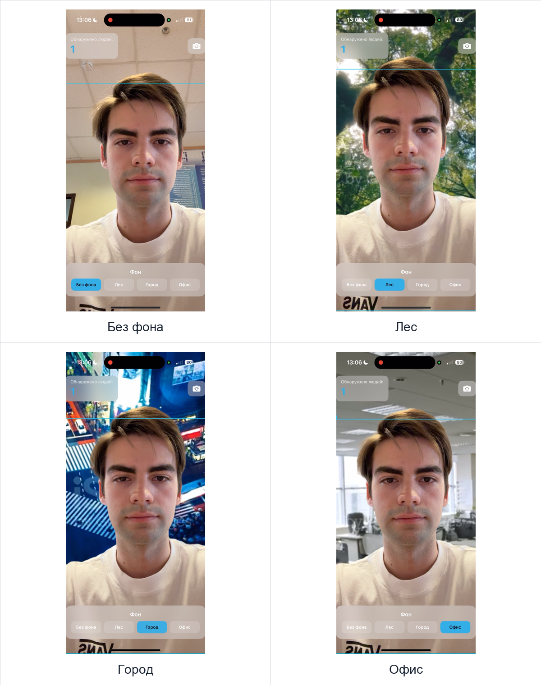
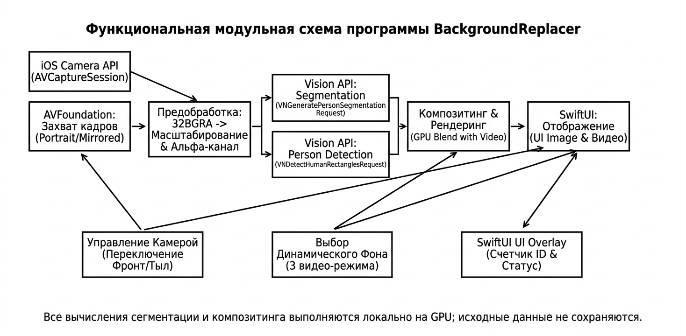
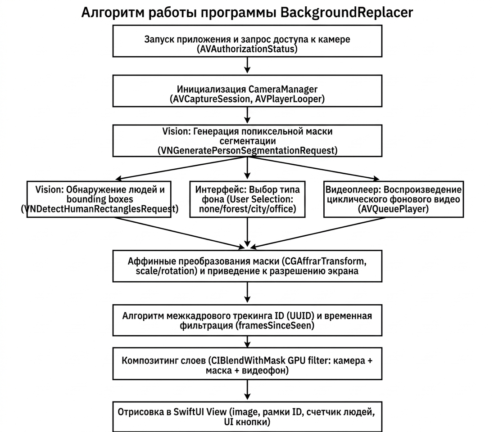
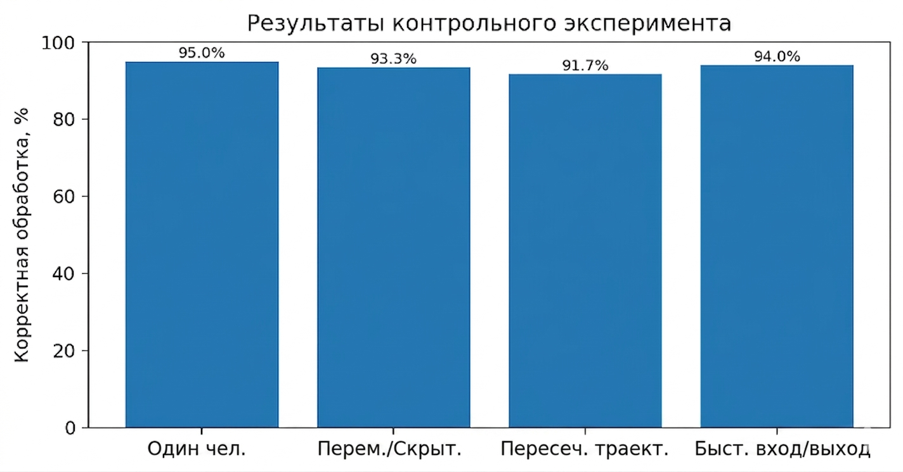

# Background Replacer & Face Identifier

Приложение для iOS, разработанное на SwiftUI, которое выполняет замену фона видеопотока и идентификацию лиц в режиме реального времени. Обработка выполняется локально с использованием системных фреймворков Apple и модели Core ML, обученной в Create ML.

## Назначение проекта

Приложение получает видеопоток с камеры устройства, обнаруживает лица и людей в кадре, классифицирует найденные лица и отображает результат поверх изображения. Пользователь может оставить исходный фон либо выбрать одно из трёх зацикленных фоновых видео: «Лес», «Город» или «Офис».

Для распознанного лица отображаются имя и оценка уверенности модели. Если лицо не соответствует классам, представленным в обучающей выборке, оно помечается как неопределённое.

## Основные возможности

- захват видеопотока с фронтальной или основной камеры;
- обнаружение лиц средствами Vision;
- сегментация силуэта человека для замены фона;
- классификация вырезанных лиц с помощью модели Core ML;
- отображение ограничивающих рамок, имени и уверенности классификации;
- цветовая индикация результата: зелёная рамка для распознанного лица и красная для неопределённого;
- выбор режима без фона или одного из трёх фоновых видео;
- плавное зацикленное воспроизведение фоновых роликов через `AVPlayerLooper`;
- отображение количества обнаруженных людей и текущего статуса идентификации.

## Архитектура

- `CameraManager.swift` настраивает `AVCaptureSession`, запрашивает доступ к камере, переключает фронтальную и основную камеры и передаёт кадры на обработку.
- `BackgroundReplacementProcessor.swift` координирует обнаружение лиц, сегментацию людей, подготовку изображений и классификацию через Core ML.
- `VideoPlayerController.swift` отвечает за воспроизведение и бесшовное зацикливание фоновых видео.
- `ContentView.swift` реализует пользовательский интерфейс: видеопоток, статус идентификации, рамки лиц и панель выбора фона.
- `MyFaceClassifier.mlmodel` содержит обученную модель классификации лиц.

## Демонстрация работы

На коллаже представлены четыре режима работы приложения: исходный видеопоток без замены фона, фон «Лес», фон «Город» и фон «Офис».

<p align="center"></p>
<p align="center"><em>Демонстрация режимов замены фона</em></p>

### Функциональная схема

<p align="center"></p>
<p align="center"><em>Функциональная модульная схема программы</em></p>

Схема показывает взаимодействие компонентов захвата кадров, предварительной обработки, анализа средствами Vision, композитинга CoreImage, классификации Core ML и отображения результата в SwiftUI.

### Алгоритм обработки

<p align="center"></p>
<p align="center"><em>Схема общего алгоритма работы программы</em></p>

На каждом кадре приложение обнаруживает лица, а при включённой замене фона дополнительно выполняет сегментацию человека. После этого формируется итоговое изображение с фоновым видео и информацией об обнаруженных лицах.

### Контрольный эксперимент

<p align="center"></p>
<p align="center"><em>Результаты контрольного эксперимента</em></p>

Контрольный эксперимент демонстрирует работу приложения на тестовом видеопотоке и позволяет оценить корректность обнаружения людей, замены фона и отображения результатов классификации.

## Обучение собственной модели

Для добавления новых распознаваемых лиц используется Create ML:

1. Создайте каталог `FaceBase` с отдельными подкаталогами для каждого класса лиц и каталогом `Unknown` для неизвестных людей.
2. Добавьте в каждый каталог фотографии лиц с разных ракурсов и при различном освещении.
3. Откройте Create ML через Xcode и выберите проект **Image Classification**.
4. Укажите `FaceBase` в качестве обучающего набора и запустите обучение.
5. Добавьте полученный файл `MyFaceClassifier.mlmodel` в target приложения в Xcode.

## Стек технологий

- **Swift 5**;
- **SwiftUI** — построение пользовательского интерфейса;
- **Vision** — обнаружение лиц и сегментация людей;
- **Core ML** — выполнение классификации лиц;
- **CoreImage** — обработка изображений и композитинг маски с видеопотоком;
- **AVFoundation** — захват кадров с камеры и работа с видеоданными;
- **AVQueuePlayer и AVPlayerLooper** — зацикленное воспроизведение фоновых видео;
- **Create ML** — обучение модели классификации.

## Установка и запуск

Для сборки проекта необходимы macOS, Xcode и iOS-устройство с камерой. Проект рассчитан на iOS 18.6 и выше.

1. Откройте `BackgroundReplacer.xcodeproj` в Xcode.
2. Убедитесь, что `MyFaceClassifier.mlmodel` добавлен в target приложения.
3. Проверьте наличие файлов `forest.mp4`, `city.mp4` и `office.mp4` в ресурсах target.
4. Выберите iOS-устройство и запустите проект через **Run**.
5. Разрешите приложению доступ к камере.

Запуск на симуляторе ограничен отсутствием физической камеры и аппаратной поддержки некоторых операций Vision и Core ML. Если модель классификации недоступна, приложение сохраняет режим обнаружения лиц без определения имени.

## Структура проекта

```text
BackgroundReplacer/
├── BackgroundReplacer/                    # Исходный код и ресурсы приложения
│   ├── BackgroundReplacerApp.swift        # Точка входа приложения
│   ├── ContentView.swift                  # Основной SwiftUI-интерфейс
│   ├── CameraManager.swift                # Захват и переключение камер
│   ├── BackgroundReplacementProcessor.swift # Обработка кадров, Vision и Core ML
│   ├── VideoPlayerController.swift        # Воспроизведение фоновых видео
│   ├── MyFaceClassifier.mlmodel           # Модель классификации лиц
│   ├── forest.mp4                         # Фон «Лес»
│   ├── city.mp4                           # Фон «Город»
│   └── office.mp4                         # Фон «Офис»
├── MyFaceClassifier.mlproj/               # Проект и контрольные точки Create ML
├── docs/demo/                             # Иллюстрации и коллаж демонстрации
├── BackgroundReplacer.xcodeproj/          # Конфигурация Xcode-проекта
└── README.md                              # Документация проекта
```

## Статус проекта

Учебное iOS-приложение реализует захват видеопотока, обнаружение лиц, классификацию с помощью Core ML и интерактивную замену фона на зацикленные видео. Для полноценной работы требуются физическое iOS-устройство, разрешение на использование камеры и добавленная модель `MyFaceClassifier.mlmodel`.
